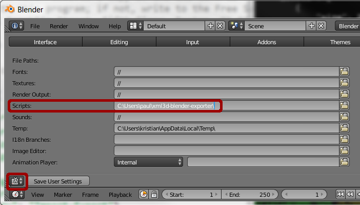

XML3D-Blender
=============

This is a very early version of a XML3D exporter for Blender.

## Installation

The add-on is not yet in the Blender repository. You need to checkout the repository:
```bash
git clone https://github.com/ksons/xml3d-blender-exporter.git
```

Setup an additional search path for scripts in [User preferences](http://wiki.blender.org/index.php/Doc:2.6/Manual/Preferences/File#File_Paths) (_User Preferences → File_).
For instance, if you cloned the repository to ```C:\Users\paul\xml3d-blender-exporter```, then add this path to the search path like this:
<p align="center"></p>

## Changelog

### 0.2.0 (2015-02-05)

Features:

  - Basic Armature support
  - Basic Armature Animation support
  - Textures converted to PNG (contribution from @jasu0x58)

### 0.1.0 (2015-01-01)

Features:

  - Basic Geometry support (based on assets)
  - Basic Material support
  - Basic Light support
  - Export Templates
  - Preview Template
    - Layers
    - Warnings
